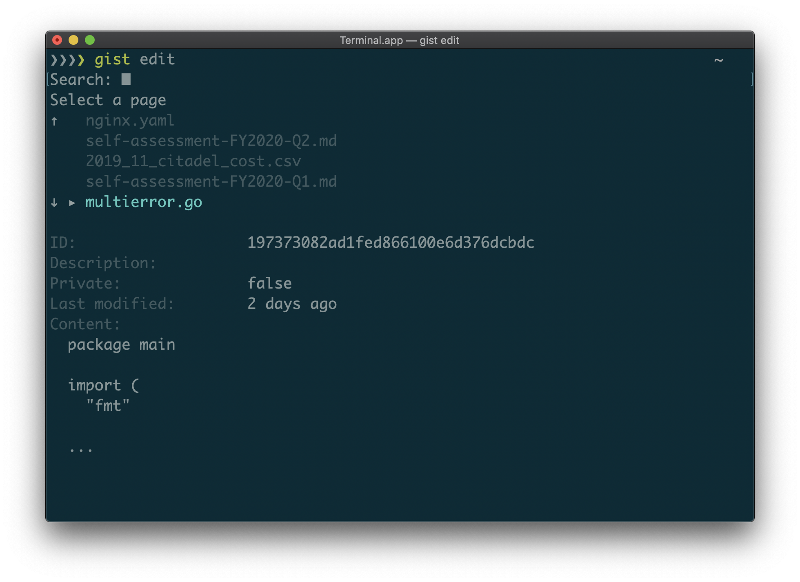

  

<em>A simple gist editor for CLI.</em>

  

    
    
     
    
    
    

## Features

- Super fast, super interactive.
- Easy to view, edit, upload and delete.
- Edit as you like, then just save it. It would be uploaded to your Gist.
- Simple and intuitive CLI UX, no complex flags or lots subcommands.
- One binary, just grab from GitHub Releases.

## Installation

Download the binary from [GitHub Releases][release] and drop it in your `$PATH`.

- [Darwin / Mac](https://github.com/b4b4r07/gist/releases/latest)
- [Linux](https://github.com/b4b4r07/gist/releases/latest)

## Versus

There are many other implements as the gist client (called "gister") such as the following that works on command-line:

- <https://github.com/defunkt/gist>
- <https://github.com/jdowner/gist>
- ...

## License

MIT

## Author

b4b4r07

[release]: https://github.com/b4b4r07/gist/releases
[license]: https://b4b4r07.mit-license.org
